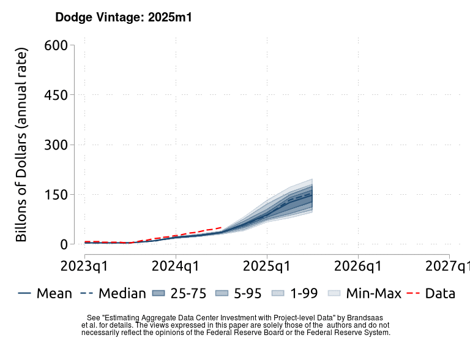
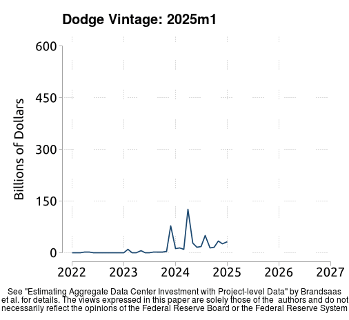
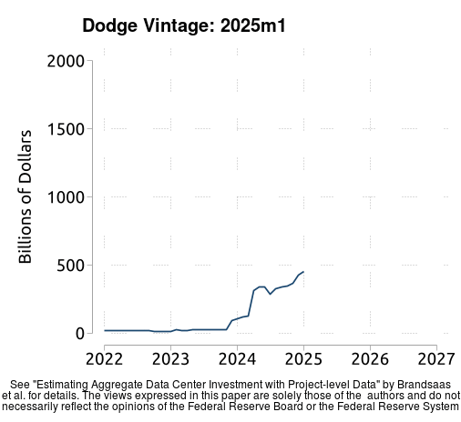
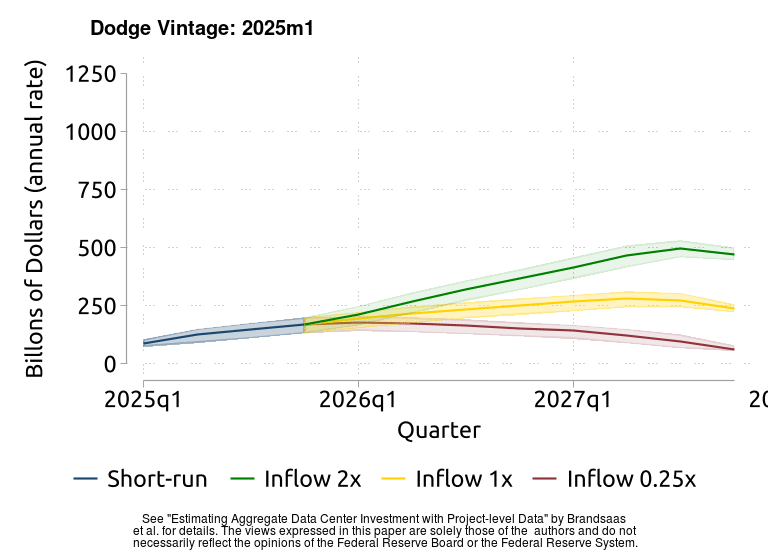
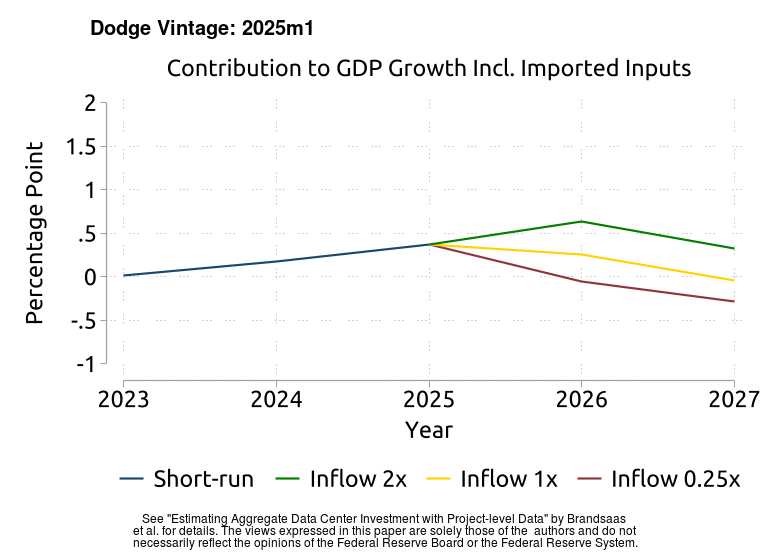
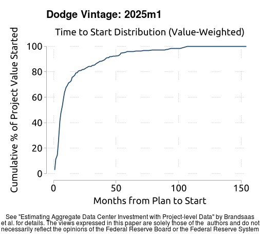
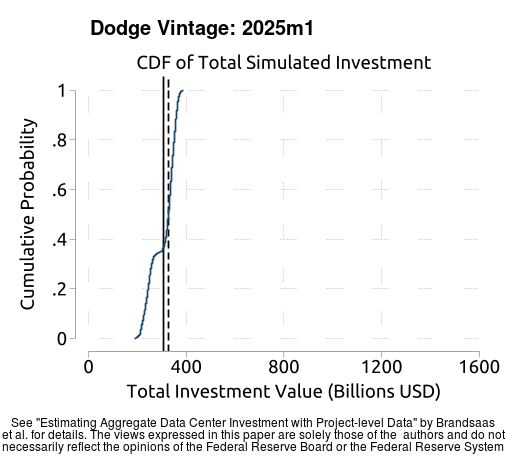
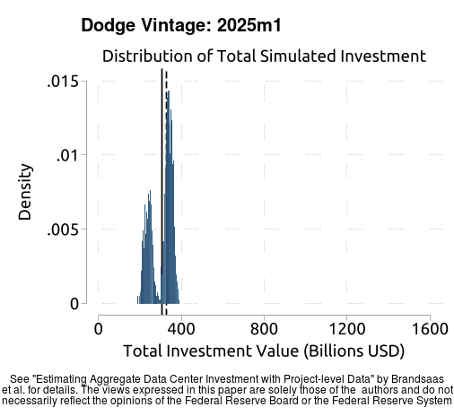

# Estimating Aggregate Data Center Investment with Project-level Data

This website contains "live" results from "Estimating Aggregate Data Center Investment with Project-level Data" by Brandsaas, Garcia, Kurtzman, Nichols, and Zytek, and will be periodically updated to reflect new results as we get additional vintages.

The December 2025 working paper is available at https://www.federalreserve.gov/econres/feds/files/2025109pap.pdf. 

Our main result, Figure 3(a), displays our estimate, nowcast, and forecast for data center investment (annualized, billions of dollars) over the near term. Below, we reproduce the figure and show how it has evolved across vintages of the Dodge microdata. The "data" line is constant since it always uses the most recent vintage of BEA data. 

Below we show how the other charts evolved over vintages of the Dodge microdata.

## Animated Pictures

### Figure 2: Value of New Plans and Planning Stock over Time
The left panel plots the flow of projects entering planning, right panel plots the stock.

### Figure 3: Data Center Investment
The first panel plots the short-run forecast, that does not depend on the assumed path of new projects. The right panel plots a longer-run forecast, where the outcomes (and uncertainty) is determined by the path of new projects. In the left panel, the red line will always refer to the most recent estimate using all available BEA data.

### Table 2: Data Center Investment
This figure re-produces the center columns of the table, that is the GDP contributions including imports and thus overstates the true impact of datacenter investment. See text for details.

### Figure S2: Time-to-Start CDF

### Figure S3: Distribution of Short-Run Simulated Investment

